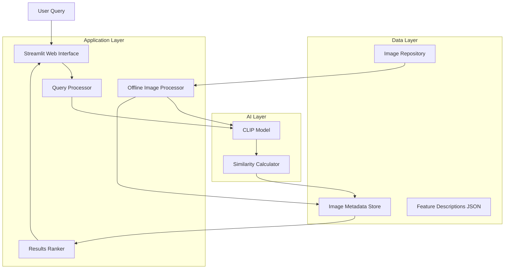

# Design Document

## Overview

The AI-powered architectural search system uses a two-phase approach: offline image analysis and real-time query processing. The system leverages CLIP (Contrastive Language-Image Pre-training) for its superior text-image matching capabilities, enabling natural language queries against architectural photographs.

The architecture separates concerns between image processing, data storage, query processing, and user interface, allowing for efficient development and future scalability.

## Architecture



## Components and Interfaces

### 1. Image Processor (Offline Component)

**Purpose**: Analyzes architectural images and generates searchable embeddings and descriptions.

**Key Methods**:
- `process_image_directory(path: str) -> None`: Processes all JPEG images in directory
- `generate_image_embedding(image_path: str) -> np.ndarray`: Creates CLIP embedding for image
- `generate_text_description(image_path: str) -> str`: Creates human-readable description
- `save_metadata(metadata: dict) -> None`: Stores embeddings and descriptions to JSON

**Dependencies**: 
- CLIP model (openai/clip-vit-base-patch32)
- PIL for image processing
- NumPy for embedding operations

### 2. Query Processor

**Purpose**: Handles user queries and finds matching images using semantic similarity.

**Key Methods**:
- `process_query(query: str) -> List[SearchResult]`: Main search function
- `generate_query_embedding(query: str) -> np.ndarray`: Creates CLIP embedding for text
- `calculate_similarities(query_embedding: np.ndarray) -> List[float]`: Computes cosine similarity
- `rank_results(similarities: List[float]) -> List[SearchResult]`: Orders results by relevance

**Data Structures**:
```python
@dataclass
class SearchResult:
    image_path: str
    confidence_score: float
    description: str
    similarity_score: float
```

### 3. Web Interface (Streamlit)

**Purpose**: Provides user-friendly interface for queries and result display.

**Key Components**:
- Text input widget for natural language queries
- Image grid display for search results
- Confidence score indicators
- Description overlays for each result

**Layout Structure**:
- Header with application title and description
- Search input section with example queries
- Results grid (3-5 images per row)
- Individual result cards showing image, score, and description

### 4. Data Storage Layer

**Image Repository Structure**:
```
images/
├── brick_buildings/
├── glass_steel/
├── stone_facades/
└── mixed_materials/
```

**Metadata Storage (JSON)**:
```json
{
  "images": [
    {
      "path": "images/brick_buildings/red_brick_house.jpg",
      "embedding": [0.1, 0.2, ...],
      "description": "Red brick residential building with pitched roof and white window frames",
      "features": ["red brick", "pitched roof", "residential", "white windows"]
    }
  ]
}
```

## Data Models

### Image Metadata Model
```python
class ImageMetadata:
    path: str
    embedding: np.ndarray
    description: str
    features: List[str]
    file_size: int
    dimensions: Tuple[int, int]
    processed_date: datetime
```

### Query Model
```python
class Query:
    text: str
    embedding: np.ndarray
    timestamp: datetime
    results_count: int
```

### Configuration Model
```python
class AppConfig:
    image_directory: str = "images/"
    metadata_file: str = "image_metadata.json"
    max_results: int = 5
    similarity_threshold: float = 0.1
    clip_model_name: str = "ViT-B/32"
```

## Error Handling

### Image Processing Errors
- **Corrupted Images**: Skip and log error, continue processing remaining images
- **Unsupported Formats**: Convert to JPEG or skip with warning
- **Memory Issues**: Process images in batches, implement cleanup

### Query Processing Errors
- **Empty Queries**: Display helpful message with example queries
- **Model Loading Failures**: Show error message and fallback instructions
- **No Results Found**: Display "No matches found" with query suggestions

### Web Interface Errors
- **File Not Found**: Display placeholder image with error message
- **Slow Loading**: Show loading spinner with progress indication
- **Network Issues**: Graceful degradation with cached results

## Testing Strategy

### Unit Testing
- **Image Processor**: Test embedding generation, description creation, metadata storage
- **Query Processor**: Test similarity calculations, result ranking, edge cases
- **Data Models**: Test serialization, validation, error handling

### Integration Testing
- **End-to-End Search**: Test complete query flow from input to results
- **Image Loading**: Test various image formats and sizes
- **Performance**: Measure query response times under different loads

### User Acceptance Testing
- **Query Accuracy**: Test with 10+ predefined architectural queries
- **Interface Usability**: Verify intuitive navigation and clear result presentation
- **Demo Reliability**: Ensure consistent performance during presentation scenarios

### Test Data Requirements
- **Sample Queries**: "red brick buildings", "flat roof structures", "glass facades", "stone columns"
- **Expected Results**: Manually curated correct matches for accuracy validation
- **Performance Benchmarks**: Sub-5-second response time for all queries

## Performance Considerations

### Offline Processing Optimization
- Batch image processing to reduce model loading overhead
- Implement caching for processed embeddings
- Use efficient image resizing before CLIP processing

### Real-time Query Optimization
- Pre-load CLIP model at application startup
- Use NumPy vectorized operations for similarity calculations
- Implement result caching for repeated queries

### Memory Management
- Load images on-demand for display only
- Store embeddings in efficient format (float32 vs float64)
- Implement garbage collection for large image batches

## Security and Privacy

### Data Protection
- All processing occurs locally without external API calls
- No user query logging or tracking
- Images remain on local filesystem

### Input Validation
- Sanitize user queries to prevent injection attacks
- Validate image file types and sizes during processing
- Implement rate limiting for query processing